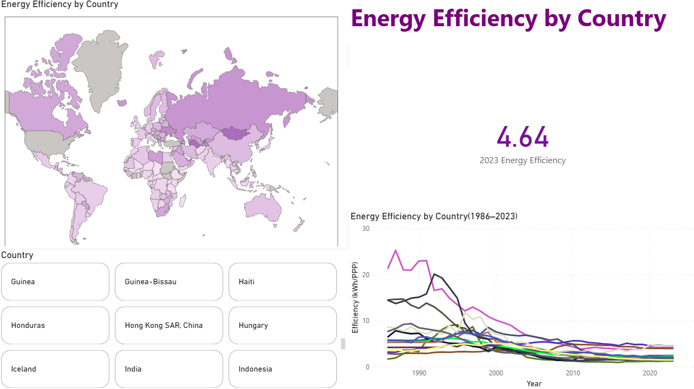
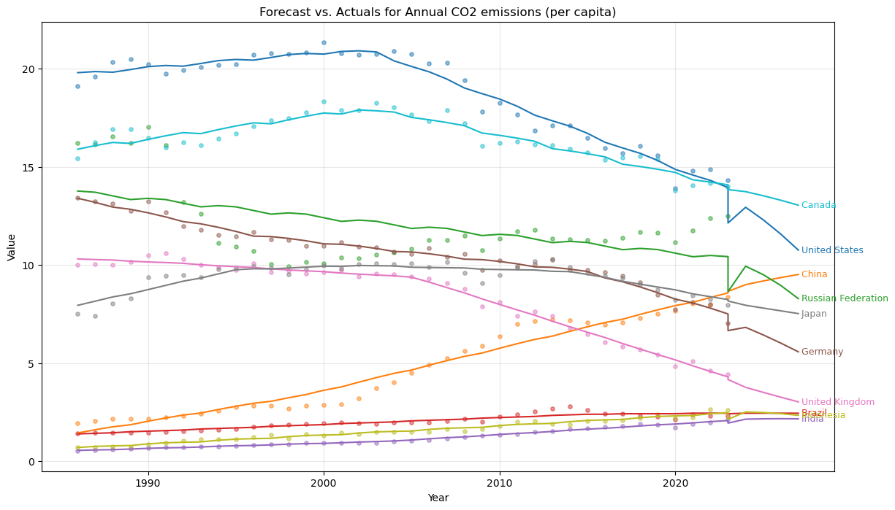

# Global CO₂ Emissions and Energy Consumption

This project looks at how **CO₂ emissions and energy use have changed over time**, and where things might be heading next. It covers everything from cleaning messy datasets to building dashboards and running forecasts.

---

## Project Milestones

### 1. Data Preparation (Python Notebook)

* Started with raw environmental data.  
* Cleaned it up & fixed missing values, removed extra metadata, reshaped the tables.  
* The result is a **well-structured dataset** that all later steps are built on.  

### 2. Interactive Visualization (Power BI Dashboard)

* Pulled the cleaned dataset into **Power BI**.  
* Built dashboards that let you explore trends interactively.  
* You can dive into:  
  * CO₂ emissions at global and country level  
  * Energy consumption patterns  
  * How different regions compare over time  

For more details (with screenshots), check out the [Interactive Visualization README](./srcs/interactive-visualization/README.md).

### 3. Predictive Modeling (Python Notebook)

* Took the cleaned dataset and used it for **time-series forecasting**.  
* Used the **Facebook Prophet** model to project the next 5 years for:  
  * CO₂ emissions  
  * Energy consumption  
  * Sustainability-related financial metrics  
  * Efficiency measures  
* These forecasts give a look at possible future trends and highlight the main countries driving them.  

Example forecast:  
  

Other forecast graphs are available in this [folder](./srcs/predictive-modeling/screenshots).

---

## Tech Stack

* **Python** (Pandas, Prophet, Matplotlib)  
* **Power BI**  
* **Jupyter Notebook**

---

## Goals

* Create a **clean, ready-to-use dataset**.  
* Make it possible to **interactively explore environmental data**.  
* Provide **forecast-based insights** into emissions and energy use.  
