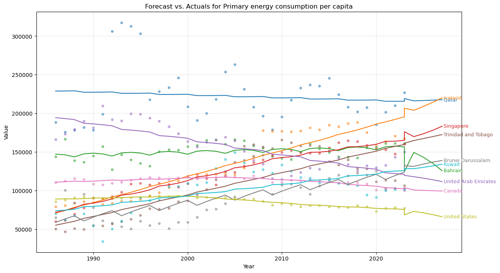
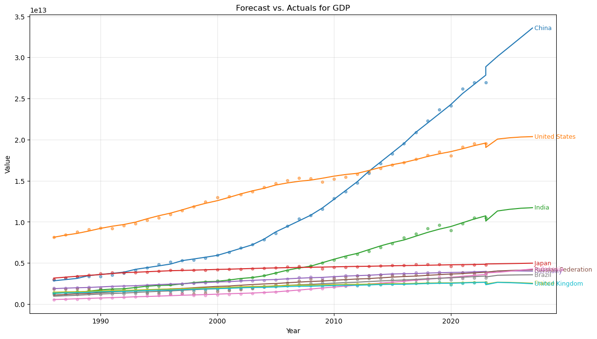
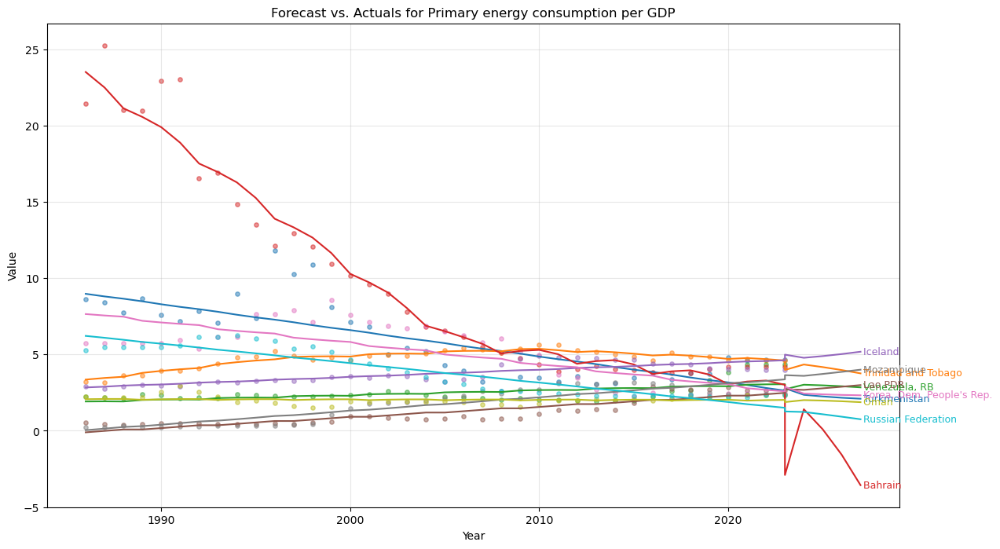

# Global CO₂ Emissions and Energy Consumption

This project explores historical trends in **global CO₂ emissions and energy consumption**, transforming raw datasets into actionable insights through data cleaning, visualization, and predictive modeling.

---

## Project Milestones

### 1. Data Preparation (Python Notebook)

* Load raw environmental datasets.
* Perform **intensive cleaning, preprocessing, and feature engineering**.
* Handle missing values, drop irrelevant metadata, reshape data into a long format.
* Deliver a **structured and reliable dataset** that serves as the foundation for all analyses.

### 2. Interactive Visualization (Power BI Dashboard)

* Import the cleaned dataset into **Power BI**.
* Build **dynamic dashboards** for exploratory analysis.
* Provide **interactive storytelling tools** for users to explore:
  * Global and country-level CO₂ emissions.
  * Energy consumption trends.
  * Comparisons across regions and time.

A more detailed explanation (with screenshots) is available in the [Interactive Visualization README](./srcs/interactive-visualization/README.md).

### 3. Predictive Modeling (Python Notebook)

* Leverage the cleaned dataset for **time-series forecasting**.  
* Apply the **Facebook Prophet** model to generate 5-year forecasts for:
  * CO₂ emissions  
  * Energy consumption  
  * Financial sustainability metrics  
  * Efficiency measures  
* Provide **insights into future environmental trends** and highlight top contributing countries.  

Forecasts (from Prophet model):  
  
  
  

---

## Tech Stack

* **Python** (Pandas, Prophet, Matplotlib)  
* **Power BI**  
* **Jupyter Notebook**

---

## Goals

* Provide a **clean dataset** ready for analysis.  
* Enable **interactive exploration** of environmental trends.  
* Deliver **predictive insights** into future emissions and energy use.  
