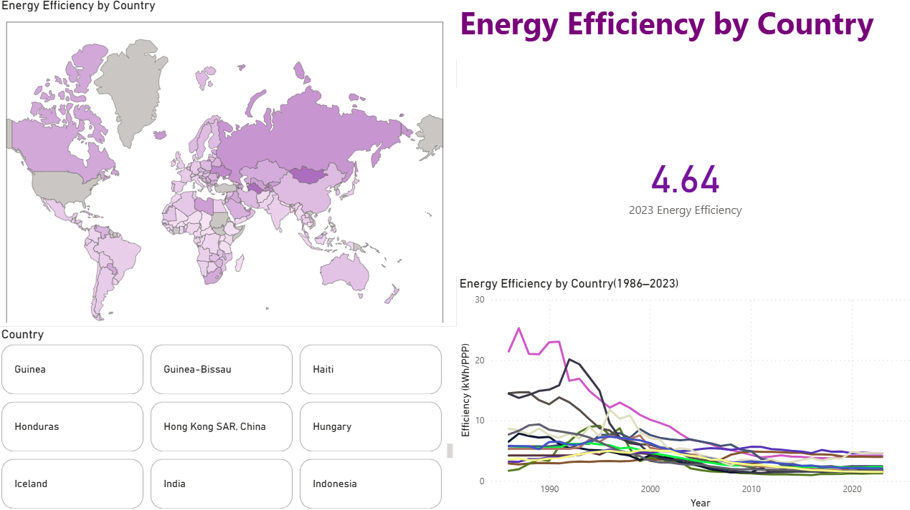
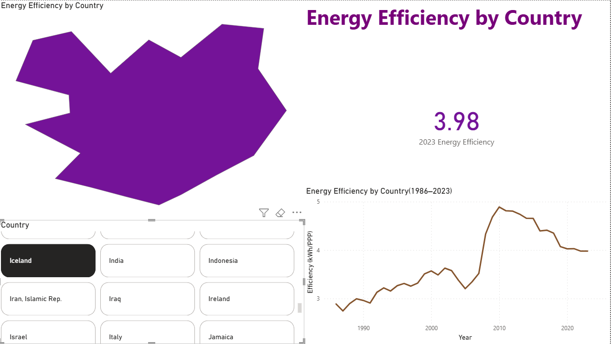

# Global Environmental Dashboard

An interactive Power BI dashboard analyzing **CO2 emissions, energy usage, financial impacts, and efficiency across countries**.  
The report includes 4 main pages (**CO2, Financial, Energy, Efficiency**) and a **Top 10 summary page**.

---

## Pages & Contents

### CO2 Page
- **Unit:** Tonnes of CO2 / CO2-equivalent  
- **Visuals:** Heatmap, Line Chart (Top 15 + country slicer), 2023 Emission Card  
- **Color Theme:** Red gradient  

### Financial Page
- **Unit:** PPP dollars (2011 constant prices)  
- **Visuals:** Heatmap, Line Chart, 2023 Card  
- **Color Theme:** Green gradient  

### Energy Page
- **Unit:** Terawatt-hours/year, Kilowatt-hours/year  
- **Visuals:** Heatmap, Line Chart, 2023 Card  
- **Color Theme:** Blue gradient  

### Efficiency Page
- **Unit:** Kilowatt-hours per PPP  
- **Visuals:** Heatmap, Line Chart, 2023 Card  
- **Color Theme:** Orange gradient  

### Top 10 Page
- **Visual:** Bar chart showing 2023 Top 10 countries for each metric  

---

## 🎛️ Interactivity

- **Country slicer** → lets users pick any country (even if not in Top 15).  
- **Filters applied globally** → excludes "World" as a country.  
- **Page-specific units** → each page restricted to its own metrics.  

