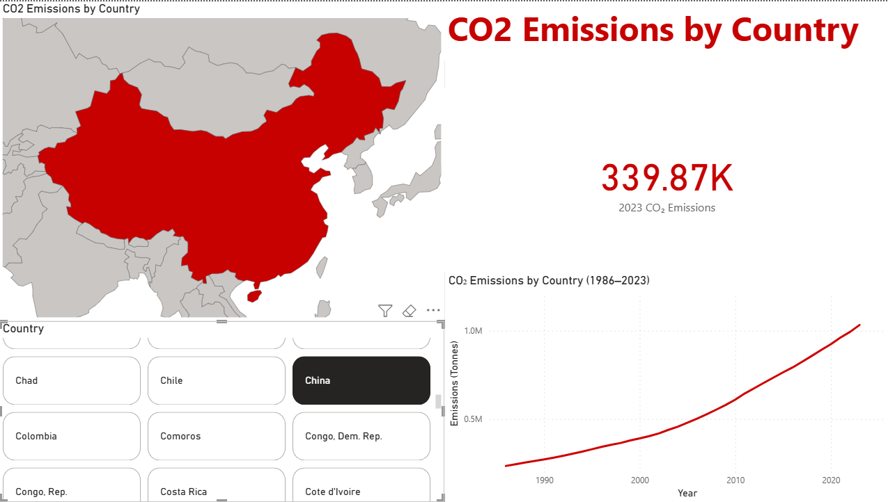
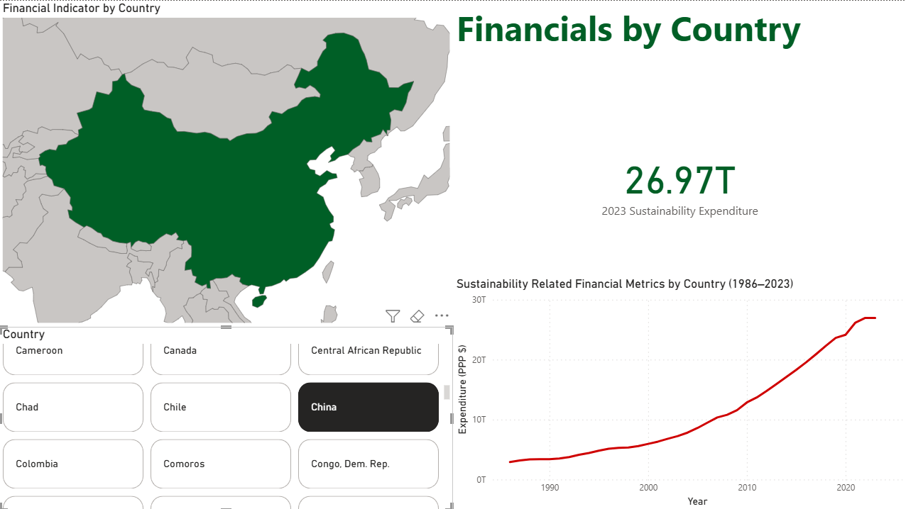
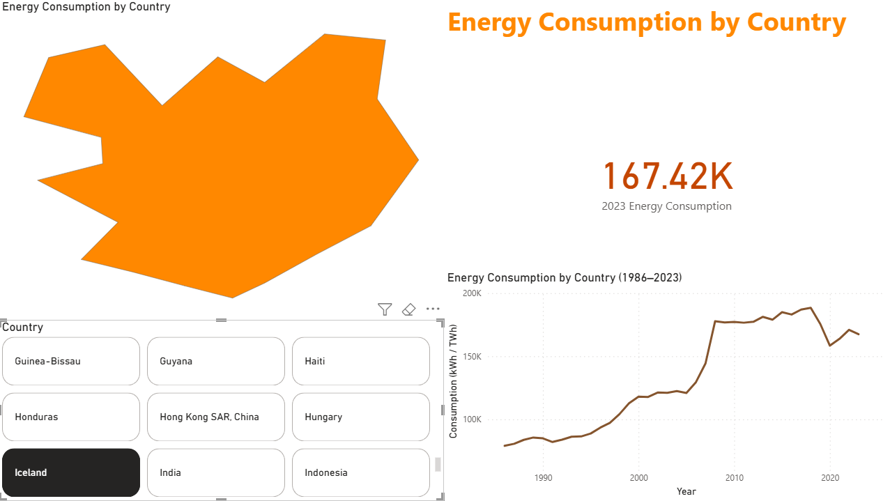
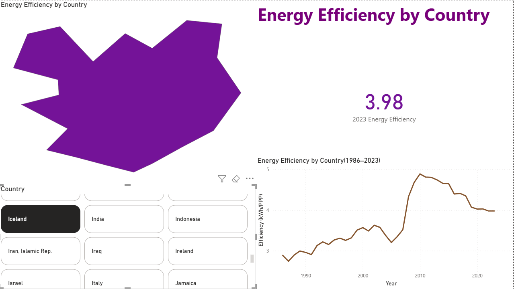
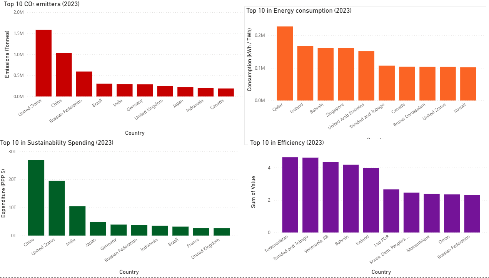

# Global Environmental Dashboard  

A Power BI dashboard bringing together **CO₂ emissions, energy use, financial data, and efficiency metrics** across countries.  
It includes 4 main pages (**CO₂, Financial, Energy, Efficiency**) plus a **Top 10 summary page**.  

---

## Pages & Contents  

### CO₂ Page  
- **Units:** Tonnes of CO₂ / CO₂-equivalent  
- **What’s shown:** Heatmap, time-series line chart (Top 15 + slicer), snapshot card for 2023  
- **Theme:** Red gradient  
  

### Financial Page  
- **Units:** PPP dollars (constant 2011 prices)  
- **What’s shown:** Heatmap, line chart, 2023 snapshot card  
- **Theme:** Green gradient  
  

### Energy Page  
- **Units:** Terawatt-hours per year, Kilowatt-hours per year  
- **What’s shown:** Heatmap, line chart, 2023 snapshot card  
- **Theme:** Blue gradient  
  

### Efficiency Page  
- **Units:** Kilowatt-hours per PPP dollar  
- **What’s shown:** Heatmap, line chart, 2023 snapshot card  
- **Theme:** Orange gradient  
  

### Top 10 Page  
- **What’s shown:** Bar chart of the Top 10 countries in 2023 for each indicator  
  

---

## Interactivity  

- **Country filter** → pick any country (not just the Top 15).  
- **Global filters** → “World” is excluded from country lists.  
- **Page-specific units** → each page only uses its own measurement system.  
